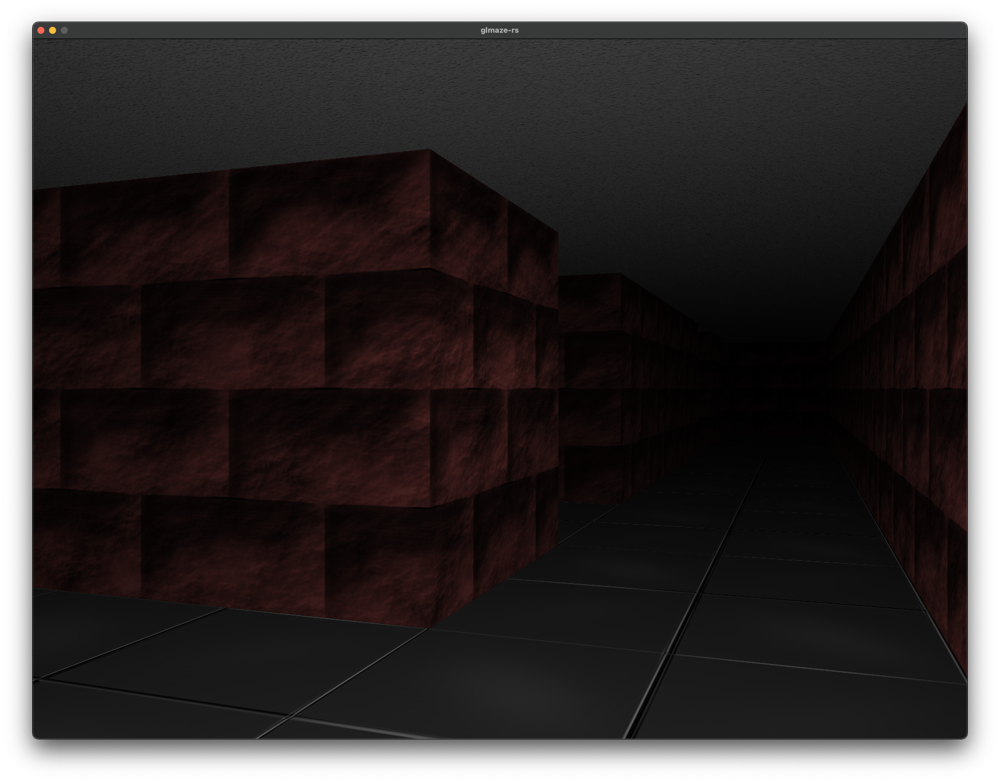

# glmaze-rs
This is [glMaze](https://github.com/DragonSWDev/glMaze) project rewritten in Rust for learning purposes.

## Manual
glmaze-rs expects assets and shaders directories to be placed in same directory as binary.

### Configuration options
Configurations is specified by command line arguments or by ini configuration file. Command line options can be specified in any order and count. Command line arguments have higher priority and will override config file values. 

**-width=value** - Window width

**-height=value** - Window height
#### Note: These values are respected only if game works in windowed mode. In fullscreen mode game always set desktop resolution. With custom window size both values (width and height) needs to be specified and height can't be bigger than width. Default size is 800x600.

**-size=value** - Maze size (Min is 10, max is 100000, default 20). 
#### Note: For big mazes (more than 1000) it's better to use RD generator because DFS is pretty slow and generating big mazes will last long time even on fast CPU. Big mazes will also consume more memory. For 100000 size (RD generator) application consumes over 9 GiB of RAM.

**-disable-collisions** - Disable collisions

**-fullscreen** - Run in fullscreen mode

**-generator=value** - Select maze generator: "RD" for recursive division and "DFS" for depth-first search. Default is "RD".

**-seed=value** - Generator seed

**-portable** - Don't try to load or create config file

**-disable-mouse** - Disable mouse control

**-disable-audio** - Disable audio

Configuration file is located in following directories:

#### Linux
~/.config/DragonSWDev/glmaze-rs/

#### Windows
%appdata%\DragonSWDev\glmaze-rs\

#### macOS
~/Library/Application Support/DragonSWDev/glmaze-rs/

### Controls
By default camera is controlled by mouse and W/S keys are used for moving forward/backward. When mouse control is disabled then camera is rotated left and right by A and D keys.

## License
glmaze-rs is distributed under the terms of MIT License. Project depends on OpenGL, SDL2 and following Rust crates: winit, glutin, glutin-winit, raw-window-handle, dirs, gl, image, cgmath, rand, rand_seeder, rand_pcg, rust-ini and kira. For information about licensing check their respecitve websites. Assets are distributed under different licenses, for details check [license.txt](/assets/license.txt) file in assets directory.  
